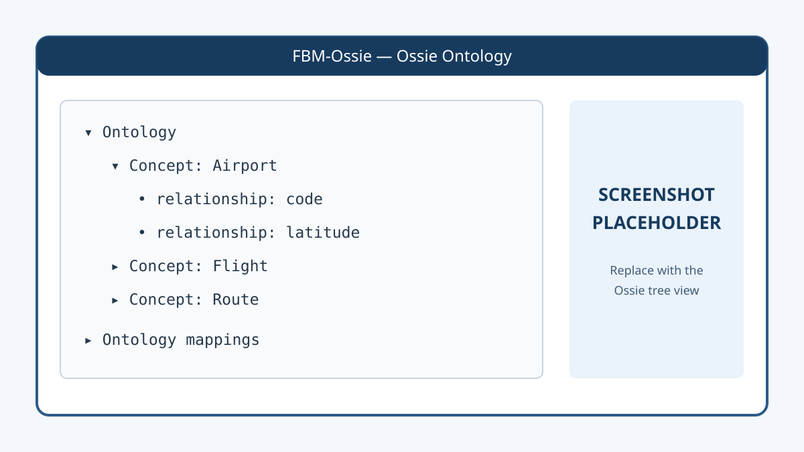
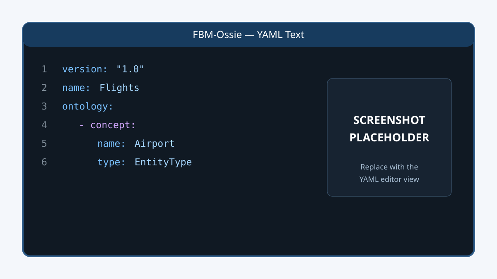
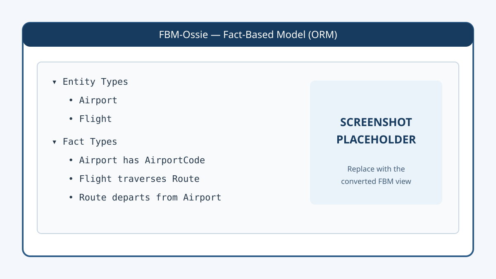

# FBM-Ossie

**A working bridge between Fact-Based Modelling and Apache Ossie.**

FBM-Ossie is an independent .NET viewer and two-way conversion experiment for [Fact-Based Modelling](https://www.factengine.ai/index.php/articles/224-fact-based-modelling) (FBM/ORM) and the [Apache Ossie](https://ossie.apache.org/) semantic interchange format.

```text
Fact-Based Model (.fbm)  ⇄  FBM-Ossie  ⇄  Apache Ossie ontology (.yaml)
```

Import a model, inspect both representations, convert it, and see which semantics survive the journey.

It provides:

- Ossie YAML parsing, serialisation, and tree-based inspection.
- Import of Fact-Based Model (`.fbm`) files.
- Conversion from FBM/ORM models to Ossie ontology YAML.
- Conversion from Ossie ontology YAML to an FBM model.
- Side-by-side views of the Ossie structure, YAML text, and resulting FBM model.
- Worked examples based on Ossie’s `flights.yaml`, a TPC-DS semantic model, and a Cinema Bookings FBM model.

> **Project status:** Experimental interoperability implementation. It is intended to produce implementation evidence and support discussion with the Ossie community; it is not yet a production converter.

## Screenshots

These are placeholders for the first public release. Replace the files with actual screenshots while keeping the same filenames.

### Explore an Ossie ontology



### Inspect the source or generated YAML



### Review the converted Fact-Based Model



## Why this project exists

Ossie’s ontology model aligns closely with established FBM/ORM concepts: Entity Types, Value Types, role-based Fact Types, reference schemes, constraints, derivations, and natural-language verbalisation.

Building a two-way converter lets us test where those semantics map directly and where additional specification work may be useful. One current investigation is the lossless representation of objectified or nested Fact Types, where a Fact Type is itself treated as an Entity Type that can play roles in other Fact Types.

## Application

The Windows application can:

1. Import an Ossie `.yaml` file.
2. Inspect its ontology or semantic-model structure.
3. View and search the source YAML.
4. convert an ontology to an FBM model and export it as `.fbm`.
5. Import an `.fbm` model, inspect it, and save its converted Ossie ontology as `.yaml`.

## Requirements

- Windows
- [.NET 10 SDK](https://dotnet.microsoft.com/download/dotnet/10.0)
- The bundled `FactEngineForServices.dll`, licensed by FactEngine.AI for non-commercial use; see [Licence](#licence)

## Build

From the repository root:

```powershell
dotnet restore .\FBM-Ossie.slnx
dotnet build .\FBM-Ossie.slnx --configuration Release
```

Run the dependency-free verification suite:

```powershell
dotnet run --project .\FBM-Ossie.Verification\FBM-Ossie.Verification.csproj --configuration Release
```

Run the application:

```powershell
dotnet run --project .\FBM-Ossie.WinForms\FBM-Ossie.WinForms.vbproj
```

The current Release build has been verified with .NET SDK 10.0.302.

## Try an example

After launching the application:

1. Select **File → Import → Ossie YAML file**.
2. Open `FBM-Ossie\Example\flights.yaml`.
3. Explore the **Ossie**, **.YAML Text**, and **Fact-Based Model (ORM)** tabs.
4. Use **File → Export → as .fbm Fact-Based Model** to inspect the generated model in compatible FBM tooling.

The `CinemaBookings.fbm` example exercises a broader FBM model, including objectification cases that inform the current Ossie format discussion.

## Project structure

| Path | Purpose |
| --- | --- |
| `FBM-Ossie/` | .NET Standard Ossie document model plus YAML parsing and serialisation |
| `FBM-Ossie.WinForms/` | Windows viewer and FBM ↔ Ossie mapping implementation |
| `FBM-Ossie.Verification/` | Executable checks for YAML detection, parsing, and round-trip serialisation |
| `FBM-Ossie/Example/` | Ossie YAML and FBM example models |
| `Notes/` | Implementation findings and candidate specification proposals |
| `Dependencies/` | Local binary dependency used by the current WinForms implementation |

## Known scope and limitations

- The implementation is exploratory and does not claim complete coverage of either specification.
- Ontology conversion is more developed than semantic-model conversion.
- Some FBM constraint families do not yet have an established first-class Ossie representation.
- Objectified Fact Types currently require a candidate extension to round-trip their complete semantics.
- The examples derived from Apache Ossie retain their upstream Apache licence headers.
- Conversion-level automated tests and a distributable application package have not yet been added.

## Binary dependency licence

`FBM-Ossie.WinForms` references `Dependencies/FactEngineForServices.dll`. The assembly is copyright FactEngine.AI, may be used for non-commercial purposes, and is necessary for `.fbm` import, export, and mapping.

The DLL is included in this repository and may be copied and redistributed for non-commercial purposes, provided its licence and copyright notices accompany it. It is not licensed under Apache 2.0.

Commercial use or commercial redistribution requires separate written permission or a commercial licence from FactEngine.AI. See [Dependencies/LICENCE.md](Dependencies/LICENCE.md) for the applicable terms.

The core `FBM-Ossie` YAML library and verification project do not reference this proprietary assembly.

## Relationship to Apache Ossie

This is an independent FactEngineCommunity project. It is not an official Apache Ossie project and is not endorsed by the Apache Software Foundation.

“Apache”, “Apache Ossie”, and the Apache feather logo are trademarks of The Apache Software Foundation.

## Contributing

Implementation feedback is welcome, particularly for:

- lossless FBM/ORM ↔ Ossie mappings;
- objectified Fact Types;
- uniqueness, mandatory-role, subset, equality, ring, and frequency constraints;
- derived Fact Types and subtype semantics;
- small example models that expose interoperability edge cases.

Please keep specification findings evidence-based: include a minimal model, the expected semantics, the current serialisation, and the semantic difference observed during round-trip conversion.

See [What we learned implementing Ossie](IMPLEMENTATION_NOTES.md) for the current implementation findings.

## Licence

Licensing is separated by component:

- Original FBM-Ossie source code and documentation are licensed under the [Apache License 2.0](LICENSE).
- `FactEngineForServices.dll` is copyright **FactEngine.AI** and may be used and redistributed for **non-commercial purposes only**; see [Dependencies/LICENCE.md](Dependencies/LICENCE.md).
- Examples retain their applicable source notices; see [FBM-Ossie/Example/LICENCE.md](FBM-Ossie/Example/LICENCE.md).
- Consolidated scope and attribution information is in [LICENCE.md](LICENCE.md) and [THIRD_PARTY_NOTICES.md](THIRD_PARTY_NOTICES.md).

Because the binary dependency is not Apache-licensed, the complete application is not an Apache-2.0-only distribution. Commercial use or redistribution requires the necessary permission or licence from FactEngine.AI.
